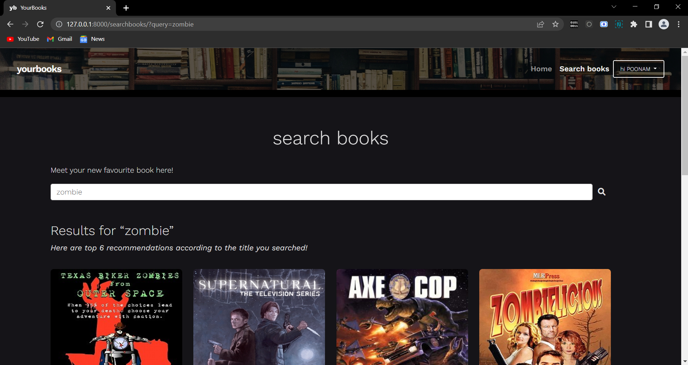

# Book Recommmender System

## Introduction

The booming technology of the modern world has given rise to the enormous book websites. Moreover, various kinds of books come into existence on a day to day basis. 
So in order to eliminate this critical decision making situation, a recommendation system has been introduced in which the suggestion on the various books can be provided based on the analysis of the reader’s interest.

The Book Recommendation System reduces the overhead of the people. It helps the reader find precisely the kind of books they are looking for from a large variety which would otherwise be nearly impossible to look through manually, saving the reader’s research time and effort.
This system when implemented in the real world provides benefits to both the service provider/seller and the consumer/reader creating a win-win situation. Numerous E-commerce sites demand the need for such advanced recommended systems to increase their revenue rate.

## Scope

Users can register and create an account to search books from a wide collection of books which reduce user’s searching time as books are arranged and distributed based on categories. Recommendation system provides the best rated book to the user for purchase. For large amounts of data, larger servers are needed to run the programs smoothly and efficiently which we cannot implement in our local server.

Only highest rated books are recommended as this system does not facilitate hybrid recommendation techniques.

## Dataset

Data Set Name: Good Reads 100k books

Link: https://www.kaggle.com/mdhamani/goodreads-books-100k

Description: It is an extensive Good Reads Dataset containing 100k books which has all the generally required columns to express, analyze and recommend books.

No of attributes: 13

## Implementation

As mentioned above, we are using goodreads.com data and which doesn’t record the user reading history. Hence, we have used a simple content-based recommendation system. We are going to build a recommendation system by using a book title as input.  
We need to find similar books to a given book and then recommend those similar books to the user.  
The algorithm used for the same is Cosine Similarity. The cosine similarity metric finds the normalized dot product of the two attributes. By determining the cosine similarity, we would effectively try to find the cosine of the angle between the two objects. The cosine of 0° is 1, and it is less than 1 for any other angle.  
It is thus a judgment of orientation and not magnitude. Two vectors with the same orientation have a cosine similarity of 1, two vectors at 90° have a similarity of 0. Whereas two vectors diametrically opposed having a similarity of -1, independent of their magnitude.  

Cosine similarity is particularly used in positive space, where the outcome is neatly bounded in [0,1]. One of the reasons for the popularity of cosine similarity is that it is very efficient to evaluate, especially for sparse vectors.

## Workflow of the system

## Output

### Home Page

### Login Page

### Profile

### Sign Up

### Search Results

Made by [@devanshiipatel](https://github.com/devanshiipatel) [@dishika1606](https://github.com/dishika1606) [@kumaripoonam9](https://github.com/kumaripoonam9) [@sreevidya-m](https://github.com/sreevidya-m)
